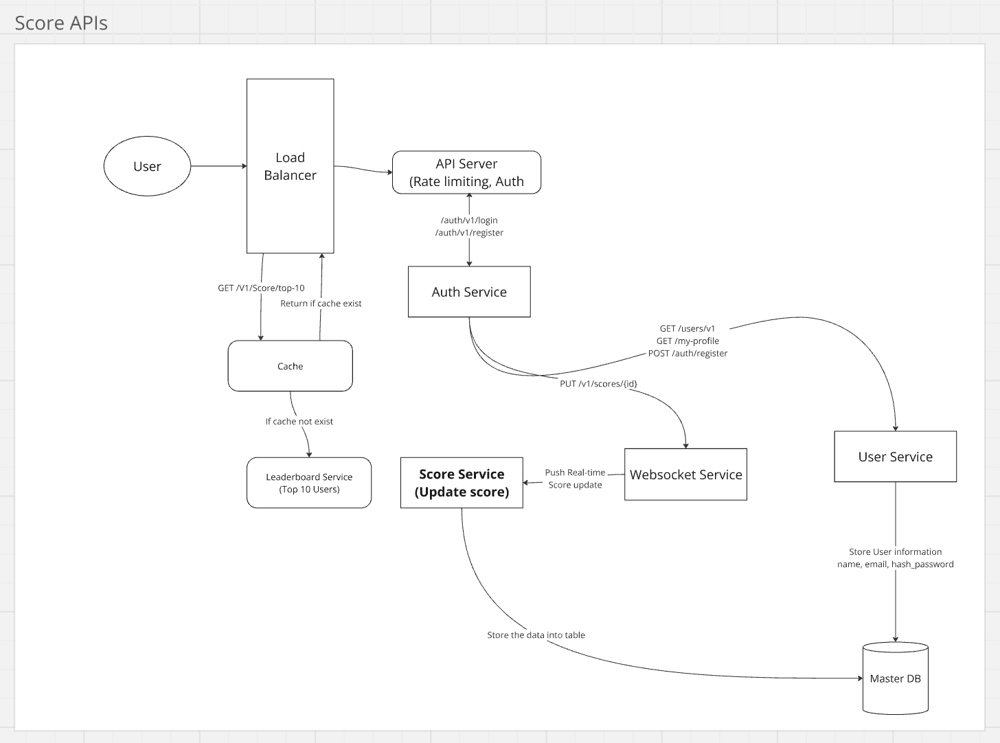

## A. Functional Requirements:
1. Update users score when receive API call with userId and score incremenet
2. Get top 10 of users with highest score
3. Real-time update on the scoreboard
4. Only authorized users can update the score

## B. Non-functional requirements:
1. Security, using Authentication and authorization to make sure the APIs is secure and only authorize user can update score.
2. Logging, we need logging because:
    - To call attention to errors or add context before crashing, 
    - Help us to tracing of program execution,
    - Capture potentially problematic state in warning
3. Error Handling is crucial here.
4. Performance, Optimize real-time updates to support a high number of concurrent users.
5. Scalability, Can handle large number of users and score update frequency.
6. Caching, Use caching to speed up retrieval of the top 10 users.
7. Documentation, will be helpful to let other devs understanding the system.

## C. API Layer:
### POST
| Endpoint Name      | Input                                                                           |
|--------------------|---------------------------------------------------------------------------------|
| /v1/users/register | name, email, passsword                                                          |
| /v1/user/login     | email, password                                                                 |
                                                                        |

### GET
| Endpoint Name     | Params                                        |
|-------------------|-----------------------------------------------|
| /v1/score/top-10  | NA                                            |
| /v1/users/{id}    | userId, example: /v1/users/1                  |
| /v1/users         | NA                                            |
| /v1/users/my-profile | JWT_auth_token                             |

### PUT
| Endpoint Name      | Params                                                                    |
|--------------------|---------------------------------------------------------------------------|
| /v1/scores/{id}     | userId, scoreIncrement, JWT_auth_token                                    |

## D. Database Layer
| User Table |                                     |
|------------|-------------------------------------|
| id         | userId AS UUID PRIMARY KEY NOT NULL |
| name       | VARCHAR                             |
| email      | VARCHAR NOT NULL                    |
| password   | VARCHAR NOT NULL                    |
| createdAt  | Timestamp                           |
| updatedAt  | Timestamp                           |
| deletedAt  | Timestamp                           |

| UserScore Table |                                                                             |
|-----------------|-----------------------------------------------------------------------------|
| id              | UUID PRIMARY KEY NOT NULL                                                   |
| userId          | UUID REFERENCES users(id) ON DELETE SET NULL,  -- Link to User table        |
| score           | BIGINT DEFAULT 0                                                            |
| createdAt       | Timestamp                                                                   |
| updatedAt       | Timestamp                                                                   |           
| deletedAt       | Timestamp                                                                   |           

## D. Deep Dive
The main focus of this API is the Real-time update features and performance, lets do estimation below:
### I. Performance
For performance, we have few options to optimise the performance:
1. **Caching,**  
   Redis is the most popular caching, while for this case, 
   So, for caching we have 2 options here, 
   1. **using Redis**
      Redis have program called [Redis for startup](https://redis.io/startups/) where we can use Redis for 12 months free with usage limit, i think thats enough for small-medium enterprise.
      - Pros: costly saving and fast,
      - Cons: might need more budget for Redis
   2. **using in-memory caching**
      - Pros: Faster than Redis since it's stored locally, no extra cost
      - Cons:Limited by server memory, not suitable for large datasets
2. **Database Indexing**   
   - Pros: Improves query performance for searches on specific columns (e.g., userId, score, etc.)
   - Cons: Indexes can slow down writes, more storage required    
   another solution if we want to use Database indexing, 
   Actually we can just *create a new table* that contains data specialized for read. However, this solution have their own pros and cons as well. 
   Here is the pros and cons below:     
    - Pros: Optimized for reading, main table won't be impacted by indexing when doing write and update, more flexible because we can apply complex indexing here.
    - Cons: Might need more larger storage space and not suitable for handling large data set, might lead to data duplication because we keep the copy of the data.
3. Rate-limiting,
   - Pros: Prevents system overload, improves stability, and protects against abuse.
   - Cons: Can delay requests for legitimate users, adds complexity to system design.
4. Connection Pooling,
   Optimizes database performance by reusing existing connections. (Performance optimization)
   - Pros: Reduces overhead by reusing database connections.
   - Cons: Requires proper configuration to avoid resource exhaustion.
5. Load Balancer,
   A load balancer distributes incoming network traffic across multiple servers to ensure no single server is overwhelmed, improving performance and reliability.
   - Pros: Enhances scalability, ensures high availability, and improves response time.
   - Cons: Adds complexity, requires maintenance, and can be a single point of failure if not configured redundantly.

### II. Real-time Update
For Real-time update, we have few options:
1. Event-Driven Architecture
    1. Kafka
    Kafka enables real-time data streams where producers send events, and consumers process them as they arrive. Network partitions may cause delays or event loss.
    - Pros: High throughput, low latency, scalable, and fault-tolerant
    - Cons: Complex integration, requires Kafka infrastructure, potential event delays during network issues    
2. WebSockets,
   - Pros: Enable real-time, two-way communication between client and server; ideal for live updates.
   - Cons: Can be complex to implement and maintain; may require persistent connections.
3. GraphQL Subscriptions
   - Pros: Real-time updates over WebSockets, only sends changed data, reduces payload.
   - Cons: More complex than REST, requires a GraphQL server.
4. Polling (Long or Short)
   Periodically requests updates from the server, simple but less efficient.
   - Pros: Simple and easy to implement, no persistent connection needed.
   - Cons: Less efficient, can increase server load and latency.

## E. High Level Design

### End-to-end flow summarized
1. **User Request:**  
   - The user sends a request via HTTP or WebSocket.  
   - The **Load Balancer** routes the request to the **API Server**.  
2. **Authentication:**  
   - The **Auth Service** verifies user credentials and returns tokens.  
3. **Score Update:**  
   - The **Score Service** updates the score in the **Master Database** and notifies the **WebSocket Service** for real-time updates.  
4. **Leaderboard Retrieval:**  
   - The **Cache** returns the top 10 users if available. Otherwise, the **Leaderboard Service** fetches the data from the database, updates the cache, and returns the result.  
5. **User Service:**  
   - Handles user profiles, stores user information, and receives real-time score updates via WebSocket.  

## F. Additional Notes
1. Caching Layer: Essential for performance optimization, ensuring fast leaderboard retrieval.
2. WebSocket Service: Decoupled from the Score Service for scalability, supporting multiple concurrent clients.
3. Load Balancer: Can handle both WebSocket and HTTP connections, ensuring high availability.
4. Security: Use token-based authentication (e.g., JWT) to secure API and WebSocket connections.
5. Database: Ensure proper indexing of the score table for fast leaderboard queries.